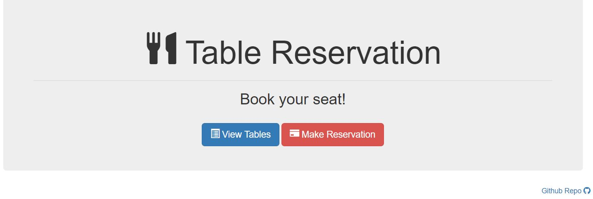

# table-reservation

* Description: Basic app demonstrating Node and Express with jQuery. Overall purpose is to help schedule reservation requests. Restaurant has just 5 tables available. First five requests get a reservation, every request after that is sent to the waiting list.
* Live Demo: <https://hanbanana.github.io/Table-Reservation/>

## To Install

* Git Clone the repository
* Navigate to the folder where the repository exists using Git Bash or Terminal
* Run the command `npm install` to download the required dependencies
* Then run the command `node server.js` to run the program